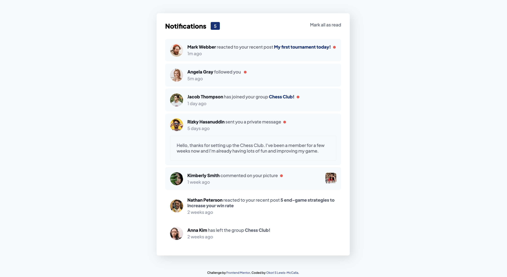
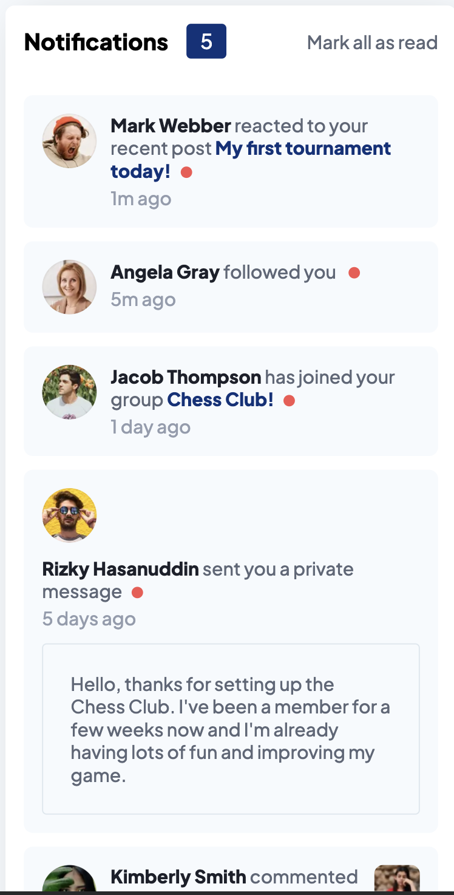

# Frontend Mentor - Notifications page solution

This is a solution to the [Notifications page challenge on Frontend Mentor](https://www.frontendmentor.io/challenges/notifications-page-DqK5QAmKbC). Frontend Mentor challenges help you improve your coding skills by building realistic projects.

## Table of contents

- [Overview](#overview)
  - [The challenge](#the-challenge)
  - [Screenshot](#screenshot)
  - [Links](#links)
- [My process](#my-process)
  - [Built with](#built-with)
  - [What I learned](#what-i-learned)
  - [Continued development](#continued-development)
  - [Useful resources](#useful-resources)
- [Author](#author)

## Overview

### The challenge

Users should be able to:

- Distinguish between "unread" and "read" notifications
- Select "Mark all as read" to toggle the visual state of the unread notifications and set the number of unread messages to zero
- View the optimal layout for the interface depending on their device's screen size
- See hover and focus states for all interactive elements on the page

### Screenshot




### Links

- Solution URL: [Github](https://github.com/okori97/Responsive-notifications-page-built-using-React)
- Live Site URL: [Vercel site](https://responsive-notifications-page-built-using-react-n4lt2fhsd.vercel.app/)

## My process

### Built with

- Semantic HTML5 markup
- Flexbox
- [React](https://reactjs.org/) - JS library
- [Webpack](https://webpack.js.org/) - JS bundler

### What I learned

I learned about state management and passing state down to child components. I also learned more about Effects in react, as i had to use the dependecy array to look for changes in any elements of the unread notifications array. I also learned about webpack, which I had never used prior. I used it it add react into my then JS & HTML project. I learned that webpack can be to your front end server what nodemon is to your back end, and that was useful to know.

Parts I am proud of below:

```html
<h1>Some HTML code I'm proud of</h1>
```

```css
.proud-of-this-css {
  color: papayawhip;
}
```

I'm quite proud of using filter here. Previously, I only used filter to select what I want. Here, I use it to select everything but what I don't want and that was cool.

```js
const removeItem = (name) => {
  setUnreadNotifications((unreadNotifications) => {
    return unreadNotifications.filter(
      (notifcation) => notifcation.userName !== name
    );
  });
};

const notifications = props.item || []; /* Subtle but I think having fallbacks for variables makes so much sense, and it's not something that I did before. */

// dynamically applying classes using JSX. Was not sure it would work, was glad when it did.
 <div class={"notification " + (isRead == false ? "unread" : "")} onClick={() => markRead(index)}>


```

### Continued development

I feel like the notification component is really bloated. I've conditially rendered the notifcations based on the properties of the object, but there is a lot of repeated code. I'd like to continue learning how to do more with less. I also want to continue learning about state control and how best to use passed down props and functions.

I also want to continue learning about css. I feel like my UX background helps me get the UI right, but I feel like I can be more clever and clean about how i define my styles and use them. I probably could have used css variables here to make managing the styles easier (Imagine the company decides to change it's primary blue to red, updating that as is would demand a trawl through the css).

I'd like to come back to this project and make it full stack by building an express backend.

### Useful resources

- [using spread in react state arrays](https://react.dev/learn/updating-objects-in-state#copying-objects-with-the-spread-syntax) - This helped me for XYZ reason. I really liked this pattern and will use it going forward.

## Author

- Website - [Okori Lewis-McCalla](https://www.okori.com)
- Frontend Mentor - [@okori97](https://www.frontendmentor.io/profile/okori97)
- Twitter - [@onlyokori](https://www.twitter.com/onlyokori)
